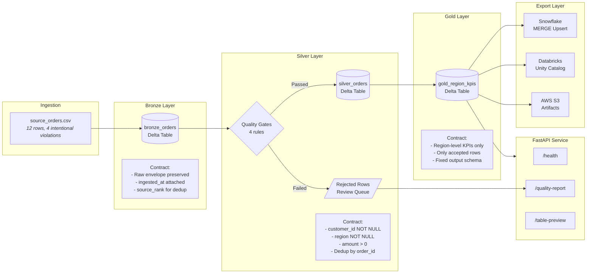

# Lakehouse Contract Lab

[](https://github.com/KIM3310/lakehouse-contract-lab/actions/workflows/ci.yml)
[](https://codecov.io/gh/KIM3310/lakehouse-contract-lab)
[](https://www.python.org/downloads/)
[](LICENSE)
[](https://github.com/astral-sh/ruff)

A production-grade **Spark + Delta Lake** medallion pipeline that enforces data contracts at every layer boundary, applies declarative quality gates, and exports governed KPIs to **Snowflake** and **Databricks Unity Catalog**. Built as a working reference implementation for contract-first data engineering.

---

## Architecture



---

## Hiring Fit and Proof Boundary

| Dimension | Details |
|-----------|---------|
| **Best fit roles** | Data Engineer, Analytics Engineer, Platform Engineer, Solutions Architect |
| **Strongest proof** | Medallion pipeline structure, quality gates, export adapters, reviewer-readable proof-pack APIs |
| **What is real** | Spark transforms, rejection logic, KPI rollups, Snowflake MERGE export logic, Databricks export bridges, local review surfaces |
| **What is bounded** | Live Snowflake and Databricks exports only activate when credentials are configured; the seeded business dataset is synthetic |

---

## Tech Stack

| Layer | Technology | Purpose |
|-------|-----------|---------|
| Compute | Apache Spark (PySpark 3.5) | Distributed transforms across medallion layers |
| Storage | Delta Lake 3.2 | ACID transactions, schema enforcement, time travel |
| API | FastAPI | Serve quality reports, table previews, health checks |
| Warehouse | Snowflake | Gold KPI export via MERGE-based upserts |
| Catalog | Databricks Unity Catalog | Delta table export via Statement Execution API |
| Object Storage | AWS S3 | Artifact upload target |
| IaC | Terraform | GCP Cloud Run deployment configuration |
| Container | Docker / Docker Compose | Reproducible full-stack execution |
| CI/CD | GitHub Actions | Lint, test, build, smoke test, Docker build |
| Quality | pytest (81+ tests), ruff | Test suite with coverage; linting and formatting |

---

## Quick Start

### Local (no Docker)

```bash
# Clone and set up
git clone https://github.com/KIM3310/lakehouse-contract-lab.git
cd lakehouse-contract-lab
python3 -m venv .venv && source .venv/bin/activate
pip install -e ".[dev]"

# Run the full pipeline: lint, test, build artifacts
make pipeline

# Start the API server
uvicorn app.main:app --host 127.0.0.1 --port 8096
open http://127.0.0.1:8096/docs
```

### Docker (recommended for full Spark + Delta rebuild)

```bash
cp .env.example .env
docker compose up --build
# API available at http://localhost:8096/docs
```

### No Java Runtime?

If Java is not installed, the pipeline validates checked-in prebuilt artifacts instead of rebuilding Spark/Delta outputs. Tests and the API layer work without a JVM.

```bash
make test       # runs 81+ tests against prebuilt artifacts
make serve      # starts the API server
```

### Makefile Reference

| Command | Description |
|---------|-------------|
| `make install` | Create venv and install all dependencies |
| `make test` | Run the full pytest suite |
| `make lint` | Run ruff linter |
| `make build` | Run the medallion pipeline and generate artifacts |
| `make pipeline` | Full pipeline: lint + test + build |
| `make verify` | Full verification: pipeline + API smoke test |
| `make serve` | Start FastAPI dev server with hot reload |
| `make docker-run` | Run via Docker Compose |

---

## Quality Gates (Bronze to Silver)

| Rule | Field | Condition | Rejected Label |
|------|-------|-----------|----------------|
| `customer_present` | `customer_id` | Must not be null | `missing_customer` |
| `region_present` | `region` | Must not be null | `missing_region` |
| `positive_amount` | `amount` | Must be > 0 | `non_positive_amount` |
| `latest_order_record` | `order_id` | Dedup, keep newest | `stale_duplicate` |

Rules are defined declaratively in `data/quality_rules.json` and enforced as chained PySpark `WHEN` expressions. Failed rows land in a rejected DataFrame with a `rejection_reason` label, accessible at `/api/runtime/quality-report`. Rejected rows are never discarded -- they form a review queue for data engineers to audit upstream quality issues.

Gold aggregates accepted silver rows by region into KPI columns: `gross_revenue_usd`, `accepted_orders`, `completed_orders`, `pipeline_orders`, `distinct_customers`.

---

## Core API

| Method | Path | Description |
|--------|------|-------------|
| `GET` | `/health` | Service health with proof-pack links |
| `GET` | `/api/runtime/quality-report` | Data quality gate results with rejected row preview |
| `GET` | `/api/runtime/table-preview/{layer}` | Layer preview: `bronze` / `silver` / `gold` |
| `GET` | `/api/runtime/pipeline-summary` | Pipeline metrics across all three layers |
| `GET` | `/api/runtime/export-status` | Snowflake, Databricks, S3 export configuration status |

---

## Deployment

All cloud integrations are env-var gated -- the project runs fully locally without any cloud credentials.

**Snowflake** -- set `SNOWFLAKE_ACCOUNT`, `SNOWFLAKE_USER`, `SNOWFLAKE_PASSWORD`. Gold KPIs are written via MERGE-based upserts to `LAKEHOUSE_LAB.GOLD.REGION_KPIS`.

**Databricks Unity Catalog** -- set `DATABRICKS_HOST` + auth (CLI profile, service-principal OAuth, or token). Gold KPIs land as Delta tables; catalog/schema auto-created.

**AWS S3** -- set `AWS_ACCESS_KEY_ID`, `AWS_SECRET_ACCESS_KEY`, `S3_ARTIFACT_BUCKET` to enable artifact upload.

**GCP Cloud Run** -- Terraform config in `infra/terraform/`.

---

## Project Structure

```
lakehouse-contract-lab/
|-- app/
|   |-- main.py                  # FastAPI app serving pipeline artifacts
|   |-- snowflake_adapter.py     # Snowflake MERGE-based export adapter
|   |-- databricks_adapter.py    # Databricks Unity Catalog export adapter
|   |-- resource_pack.py         # Source data and config loaders
|-- scripts/
|   |-- build_lakehouse_artifacts.py  # Full medallion pipeline (Bronze/Silver/Gold)
|-- data/
|   |-- source_orders.csv        # 12-row synthetic dataset with quality violations
|   |-- quality_rules.json       # Declarative quality gate definitions
|   |-- export_targets.json      # Export target configurations
|   |-- validation_cases.json    # Test validation cases
|-- artifacts/                   # Generated pipeline outputs (JSON + Delta)
|-- tests/                       # 81+ pytest tests (adapters, API, pipeline, resource pack)
|-- docs/
|   |-- adr/                     # Architecture Decision Records
|   |-- data-contracts.md        # Contract-first approach documentation
|   |-- medallion-architecture.md # Layer-by-layer architecture guide
|-- infra/terraform/             # GCP Cloud Run deployment
|-- .github/workflows/ci.yml     # CI: lint, test, build, smoke, Docker
```

---

<details>
<summary><strong>For AI Engineers</strong></summary>

### Why This Project Matters for AI Engineering Roles

This project demonstrates the data infrastructure layer that production AI/ML systems depend on. Key signals:

- **Feature store readiness**: The medallion pipeline produces governed, versioned gold-layer datasets that mirror how feature stores ingest curated data. The quality gate pattern ensures only validated data flows into downstream model training.

- **Data contract enforcement**: The contract-first approach (declarative rules in JSON, enforced in Spark, surfaced via API) is directly applicable to ML pipelines where schema drift and silent data corruption cause model degradation.

- **Artifact lineage**: Every pipeline run produces versioned artifacts (proof-pack, quality report, review summary) with full traceability. This maps to ML experiment tracking patterns (MLflow, W&B) where provenance is critical.

- **Multi-cloud export**: The adapter pattern (Snowflake, Databricks, S3) demonstrates how to build platform-agnostic data layers that serve both analytical workloads and model training pipelines.

- **Review surfaces**: The FastAPI endpoints and proof-pack JSON artifacts provide the kind of human-in-the-loop review interfaces that responsible AI systems require for data quality auditing.

</details>

<details>
<summary><strong>For Data Engineers</strong></summary>

### Why This Project Matters for Data Engineering Roles

This project is a working reference for contract-first medallion pipelines. Key signals:

- **Real Spark + Delta execution**: Not a diagram or config-only demo. The pipeline ingests CSV, applies PySpark transforms, writes Delta tables with ACID guarantees, and tracks versions via `_delta_log`.

- **Quality gate pattern**: Four declarative rules enforced at the bronze-to-silver boundary using chained `WHEN` expressions. Rejected rows are retained (not dropped) in a review queue with labeled rejection reasons. This is the operational pattern used in production lakehouse platforms.

- **Snowflake MERGE export**: The adapter builds parameterized MERGE statements for idempotent upserts. Schema and table DDL are auto-created. Connection lifecycle is properly managed with error handling and cleanup.

- **Databricks Unity Catalog export**: Uses the Statement Execution API via the Databricks SDK. Supports token, service-principal, and CLI profile authentication. Delta tables are created with `autoOptimize` properties.

- **Observability**: Pipeline metrics (pass rate, row counts, rejection reasons) are computed and persisted as JSON artifacts, then served via FastAPI. The quality report endpoint provides programmatic access to gate results.

- **No-Java fallback**: Environments without a JVM can validate prebuilt artifacts and run the full test suite and API layer. This makes the project accessible for code review without Spark setup.

</details>

<details>
<summary><strong>For Solutions Architects</strong></summary>

### Why This Project Matters for Solutions Architecture Roles

This project demonstrates end-to-end data platform thinking. Key signals:

- **Multi-cloud export architecture**: The adapter pattern cleanly separates pipeline logic from export targets. Snowflake, Databricks, and S3 exports are env-var gated and independently configurable. Adding a new export target requires only a new adapter module.

- **Contract-first design**: Data contracts are defined declaratively (JSON), enforced programmatically (Spark), and exposed via API. This mirrors enterprise patterns where data producers publish contracts and consumers validate against them.

- **Governance and auditability**: The proof-pack artifact captures pipeline state (row counts, quality metrics, Delta versions, export status) in a single JSON document. This is the kind of artifact that compliance and data governance teams require.

- **Infrastructure as Code**: Terraform config for GCP Cloud Run deployment. Docker and Docker Compose for local and CI reproducibility. GitHub Actions CI with lint, test, build, smoke, and Docker build stages.

- **Reviewer-friendly surfaces**: The FastAPI `/docs` page, quality report endpoint, and SVG architecture board are designed to be walkable by a non-technical reviewer. The `reviewerFastPath` array in the health endpoint explicitly guides reviewers through the proof surface.

- **Env-var gating**: All cloud integrations are gated behind environment variables with sensible defaults. The project runs fully locally without any cloud credentials, making it safe for evaluation and demo.

</details>

---

## Latest Verified Snapshot

- **Verified on:** 2026-04-07
- **Command:** `make verify`
- **Outcome:** Passed locally; self-healing Python 3.11 bootstrap, 81 tests, lint, prebuilt artifact validation, and smoke checks completed successfully
- **Notes:** Snowflake export tests and Snowflake export bridge tests were rerun successfully in the repo venv, while fresh Spark assembly remains gated by local Java availability

---

## Related Projects

| Project | Description |
|---------|-------------|
| [Nexus-Hive](https://github.com/KIM3310/Nexus-Hive) | Governed NL-to-SQL analytics on top of this data |
| [enterprise-llm-adoption-kit](https://github.com/KIM3310/enterprise-llm-adoption-kit) | Enterprise LLM governance framework |

---

## License

MIT
