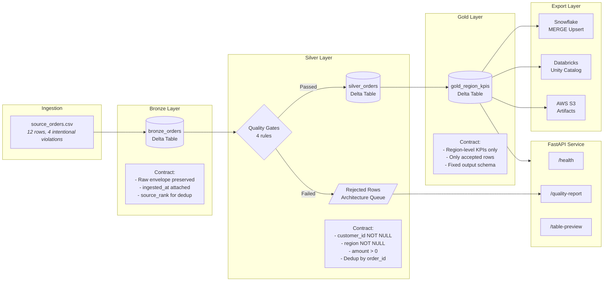

# Lakehouse Contract Lab

## Live Demo

- [Open the public GitHub Pages demo](https://kim3310.github.io/lakehouse-contract-lab/)
- Scope: credential-free, synthetic-data demo for architecture inspection and evaluators.

[](https://github.com/KIM3310/lakehouse-contract-lab/actions/workflows/ci.yml)
[](https://codecov.io/gh/KIM3310/lakehouse-contract-lab)
[](https://www.python.org/downloads/)
[](LICENSE)
[](https://github.com/astral-sh/ruff)

A production-grade **Spark + Delta Lake** medallion pipeline that enforces data contracts at every layer boundary, applies declarative quality gates, and exports governed KPIs to **Snowflake** and **Databricks Unity Catalog**. Built as a working reference implementation for contract-first data engineering.

---

## Product and System Surface

A contract-first data lab that turns data quality from a slide into a repeatable pipeline and architecture artifact.

| Lens | Definition |
|---|---|
| Audience | Data platform teams, BI teams, analytics engineers, and migration leaders. |
| Architecture path | Validate the demo, README, architecture notes, and quality gate before deeper workflow architecture. |
| System signal | Spark/Delta-style medallion pipeline, quality gates, warehouse export, contracts, and architecture-pack framing. |
| Safety boundary | Fixture data proves behavior; production use needs source-system contracts, ownership, lineage, and access policy. |
| Fast path | Run the pytest/ruff pipeline and inspect generated quality reports and contract outputs. |

## System Fast Path

- **First minute:** Inspect the contract checks, quality reports, and medallion layer artifacts before deployment notes.
- **Local demo:** Run `make smoke-no-build` for API architecture, then open `http://127.0.0.1:8096/docs`.
- **Verification:** Run `make verify`; CI uses prebuilt artifact validation when a Spark/Java runtime is unavailable.

## Service Launch Playbook

- [Service launch playbook](docs/service-launch-playbook.md) maps the repository to architecture audiences, operating gates, operating boundaries, and risk controls.

## Architecture Notes

- [Architecture guide](docs/architecture-evidence-map.md) summarizes the project angle, first files to inspect, runtime commands, and known boundaries.
- [Quality notes](docs/quality-gate.md) lists the local checks, CI surface, and release expectations for this repository.
- [Enterprise readiness notes](docs/enterprise-readiness.md) outlines security, data, operations, integration, and handoff expectations.

## Architecture



---

## Technical Proof Boundary

| Dimension | Details |
|-----------|---------|
| **Primary architecture lane** | Data contracts, analytics platform operations, and lakehouse export reliability |
| **Strongest proof** | Medallion pipeline structure, quality gates, export adapters, and architecture-readable runtime APIs |
| **What is real** | Spark transforms, rejection logic, KPI rollups, Snowflake MERGE export logic, Databricks export bridges, local architecture surfaces |
| **What is bounded** | Live Snowflake and Databricks exports only activate when credentials are configured; the seeded business dataset is synthetic |

---

## Tech Stack

| Layer | Technology | Purpose |
|-------|-----------|---------|
| Compute | Apache Spark (PySpark 3.5) | Distributed transforms across medallion layers |
| Storage | Delta Lake 3.2 | ACID transactions, schema enforcement, time travel |
| API | FastAPI | Serve quality reports, table previews, health checks |
| Warehouse | Snowflake | Gold KPI export via MERGE-based upserts |
| Catalog | Databricks Unity Catalog | Delta table export via Statement Execution API |
| Object Storage | AWS S3 | Artifact upload target |
| IaC | Terraform | GCP Cloud Run deployment configuration |
| Container | Docker / Docker Compose | Reproducible full-stack execution |
| CI/CD | GitHub Actions | Lint, test, build, smoke test, Docker build |
| Quality | pytest (81+ tests), ruff | Test suite with coverage; linting and formatting |

---

## Quick Start

### Local (no Docker)

```bash
# Clone and set up
git clone https://github.com/KIM3310/lakehouse-contract-lab.git
cd lakehouse-contract-lab
make install

# If your default python3 is older than 3.11:
make BOOTSTRAP_PYTHON=/path/to/python3.11 install

# Run the full pipeline: lint, test, build artifacts
make pipeline

# Start the API server
make serve
open http://127.0.0.1:8096/docs
```

### Docker (recommended for full Spark + Delta rebuild)

```bash
cp .env.example .env
docker compose up --build
# API available at http://localhost:8096/docs
```

### No Java Runtime?

If Java is not installed, the pipeline validates checked-in prebuilt artifacts instead of rebuilding Spark/Delta outputs. Tests and the API layer work without a JVM.

```bash
make test       # runs 81+ tests against prebuilt artifacts
make serve      # starts the API server
```

### Makefile Reference

| Command | Description |
|---------|-------------|
| `make install` | Create venv and install all dependencies |
| `make test` | Run the full pytest suite |
| `make lint` | Run ruff linter |
| `make build` | Run the medallion pipeline and generate artifacts |
| `make pipeline` | Full pipeline: lint + test + build |
| `make verify` | Full verification: pipeline + API smoke test |
| `make serve` | Start FastAPI dev server with hot reload |
| `make docker-run` | Run via Docker Compose |

---

## Quality Gates (Bronze to Silver)

| Rule | Field | Condition | Rejected Label |
|------|-------|-----------|----------------|
| `customer_present` | `customer_id` | Must not be null | `missing_customer` |
| `region_present` | `region` | Must not be null | `missing_region` |
| `positive_amount` | `amount` | Must be > 0 | `non_positive_amount` |
| `latest_order_record` | `order_id` | Dedup, keep newest | `stale_duplicate` |

Rules are defined declaratively in `data/quality_rules.json` and enforced as chained PySpark `WHEN` expressions. Failed rows land in a rejected DataFrame with a `rejection_reason` label, accessible at `/api/runtime/quality-report`. Rejected rows are never discarded -- they form an architecture queue for data engineers to audit upstream quality issues.

Gold aggregates accepted silver rows by region into KPI columns: `gross_revenue_usd`, `accepted_orders`, `completed_orders`, `pipeline_orders`, `distinct_customers`.

---

## Consolidated Operating Pattern

[Data platform operating patterns](docs/data-platform-operating-patterns.md) folds demo-pack and rollout-playbook material into the canonical contract-first path used by this repository.

---

## Core API

| Method | Path | Description |
|--------|------|-------------|
| `GET` | `/health` | Service health with architecture-artifact links |
| `GET` | `/api/runtime/quality-report` | Data quality gate results with rejected row preview |
| `GET` | `/api/runtime/table-captures/{layer}` | Layer preview: `bronze` / `silver` / `gold` |
| `GET` | `/api/runtime/pipeline-summary` | Pipeline metrics across all three layers |
| `GET` | `/api/runtime/export-status` | Snowflake, Databricks, S3 export configuration status |

---

## Deployment

All cloud integrations are env-var gated -- the project runs fully locally without any cloud credentials.

**Snowflake** -- set `SNOWFLAKE_ACCOUNT`, `SNOWFLAKE_USER`, `SNOWFLAKE_PASSWORD`. Gold KPIs are written via MERGE-based upserts to `LAKEHOUSE_LAB.GOLD.REGION_KPIS`.

**Databricks Unity Catalog** -- set `DATABRICKS_HOST` + auth (CLI profile, service-principal OAuth, or token). Gold KPIs land as Delta tables; catalog/schema auto-created.

**AWS S3** -- set `AWS_ACCESS_KEY_ID`, `AWS_SECRET_ACCESS_KEY`, `S3_ARTIFACT_BUCKET` to enable artifact upload.

**GCP Cloud Run** -- Terraform config in `infra/terraform/`.

---

## Project Structure

```
lakehouse-contract-lab/
|-- app/
|   |-- main.py                  # FastAPI app serving pipeline artifacts
|   |-- snowflake_adapter.py     # Snowflake MERGE-based export adapter
|   |-- databricks_adapter.py    # Databricks Unity Catalog export adapter
|   |-- resource_pack.py         # Source data and config loaders
|-- scripts/
|   |-- build_lakehouse_artifacts.py  # Full medallion pipeline (Bronze/Silver/Gold)
|-- data/
|   |-- source_orders.csv        # 12-row synthetic dataset with quality violations
|   |-- quality_rules.json       # Declarative quality gate definitions
|   |-- export_targets.json      # Export target configurations
|   |-- validation_cases.json    # Test validation cases
|-- artifacts/                   # Generated pipeline outputs (JSON + Delta)
|-- tests/                       # 81+ pytest tests (adapters, API, pipeline, resource pack)
|-- docs/
|   |-- adr/                     # Architecture Decision Records
|   |-- data-platform-operating-patterns.md # Consolidated rollout and demo patterns
|   |-- data-contracts.md        # Contract-first approach documentation
|   |-- medallion-architecture.md # Layer-by-layer architecture guide
|-- infra/terraform/             # GCP Cloud Run deployment
|-- .github/workflows/ci.yml     # CI: lint, test, build, smoke, Docker
```

---

## Operating Commands

- `make verify` runs the Python bootstrap, lint, pipeline tests, artifact checks, and smoke checks.
- `python -m pytest tests -q` exercises the contract compiler, export adapters, API surface, and resource pack.
- `python scripts/build_prebuilt_artifacts.py` refreshes the local JSON/Delta artifacts used by demos and API smoke checks.

---

## Related Projects

| Project | Description |
|---------|-------------|
| [Nexus-Hive](https://github.com/KIM3310/Nexus-Hive) | Governed NL-to-SQL analytics on top of this data |
| [enterprise-llm-adoption-kit](https://github.com/KIM3310/enterprise-llm-adoption-kit) | Enterprise LLM governance framework |

---

## License

MIT

## Cloud + AI Architecture

This repository includes a neutral cloud and AI engineering blueprint that maps the current proof surface to runtime boundaries, data contracts, model-risk controls, deployment posture, and validation hooks.

- [Cloud + AI architecture blueprint](docs/cloud-ai-architecture.md)
- [Machine-readable architecture manifest](docs/architecture/blueprint.json)
- Validation command: `python3 scripts/validate_architecture_blueprint.py`

## Enterprise Productization

- [Product operating model](docs/product-operating-model.md) defines the technical inspection, trust boundary, trust boundary, operating checks, and service path for this repository.

## System Architecture

- [System architecture](docs/system-architecture.md) maps the runtime boundary, data/control flow, cloud or local deployment surface, and operating assumptions for this repository.

## Service Architecture

- [Service architecture](docs/service-architecture.md) defines the cloud resources, account information, cost controls, and production guardrails needed to turn this repo into a scoped service without publishing public financial assumptions.

<!-- search-growth-readme:start -->

## Search And Service Surface

- Public entry: free synthetic pipeline and contract examples
- Paid boundary: paid connector templates, contract migration pack, and recurring data quality report
- Canonical URL: https://kim3310.github.io/lakehouse-contract-lab/
- Lead capture: https://github.com/KIM3310/lakehouse-contract-lab/issues/new?template=service-inquiry.yml&title=Private+workspace+inquiry%3A+Lakehouse+Contract+Lab
- Machine-readable offer: [docs/service-offer.json](docs/service-offer.json)
- Search growth implementation: [docs/search-growth-implementation.md](docs/search-growth-implementation.md)
- Revenue architecture: [docs/revenue-architecture.md](docs/revenue-architecture.md)

<!-- search-growth-readme:end -->
