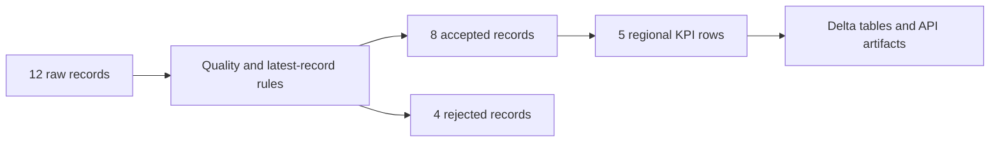

# Lakehouse Contract Lab

A reproducible Spark and Delta Lake pipeline that turns raw order records into governed regional KPIs, with rejected rows, table versions and API-readable evidence.

**Data engineering · quality gates · reproducible execution**

[Preview](https://lakehouse-contract-lab.pages.dev) · [Verification and design](docs/VERIFICATION.md) · [CI](https://github.com/KIM3310/lakehouse-contract-lab/actions) · [Detailed setup](REFERENCE.md)


```mermaid
flowchart LR
    Bronze[12 raw records] --> Quality[Quality and latest-record rules]
    Quality --> Silver[8 accepted records]
    Quality --> Rejected[4 rejected records]
    Silver --> Gold[5 regional KPI rows]
    Gold --> Delta[Delta tables and API artifacts]
```

## Inspect the implementation

| Source | What it demonstrates |
|---|---|
| [scripts/build_lakehouse_artifacts.py](scripts/build_lakehouse_artifacts.py) | Actual Spark transformations, Delta writes and deterministic exports |
| [scripts/verify_spark_runtime.py](scripts/verify_spark_runtime.py) | Fresh Spark session reloads and checks the generated Delta tables |
| [docs/evidence/spark-runtime.json](docs/evidence/spark-runtime.json) | Observed runtime versions and artifact hashes |
| [artifacts/quality-report.json](artifacts/quality-report.json) | Accepted/rejected source results |
| [app/main.py](app/main.py) | FastAPI contract and table-preview endpoints |

## Run it

```sh
make install
# Java 17 must be available; set JAVA_HOME when needed.
.venv/bin/python -m scripts.verify_spark_runtime
make verify
```

## Evidence

99 unit/API tests pass. Actual local Spark 3.5.9 + Delta 3.3.3 execution writes and reloads 12 bronze, 8 silver and 5 gold rows; 4 source rows are rejected. The runtime report records versions and source/artifact hashes.

## Scope

This is a synthetic 12-row fixture on local[2], not a scale benchmark. Snowflake/Databricks exports and cloud infrastructure were not executed in this verification. LAKEHOUSE_VALIDATE_PREBUILT_ONLY=1 validates snapshots only and is explicitly reported as such.

## Further reading

[Architecture](docs/cloud-ai-architecture.md) · [Architecture manifest](docs/architecture/blueprint.json) · [Architecture validator](scripts/validate_architecture_blueprint.py) · [Original reference](REFERENCE.md)
